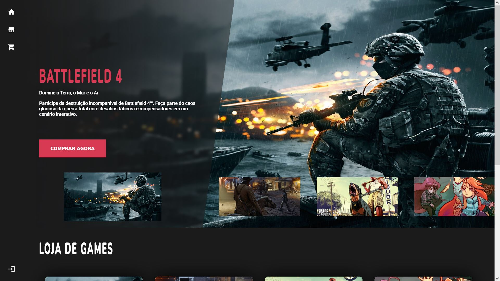
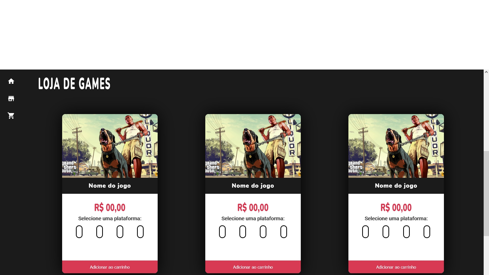
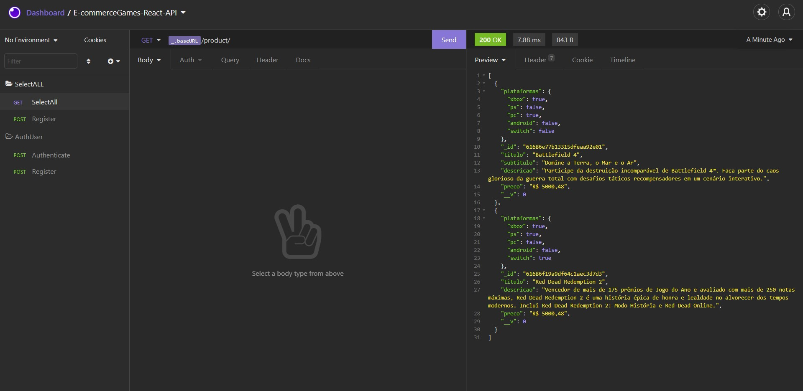
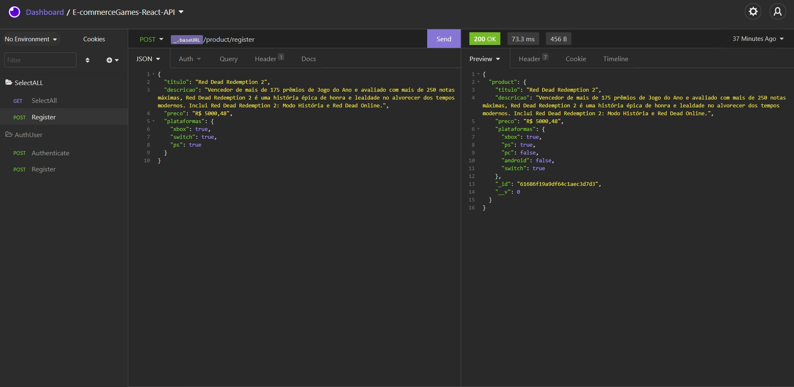
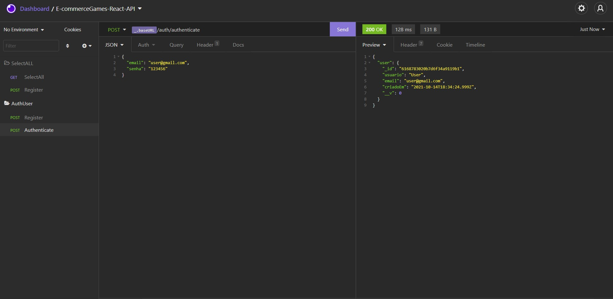
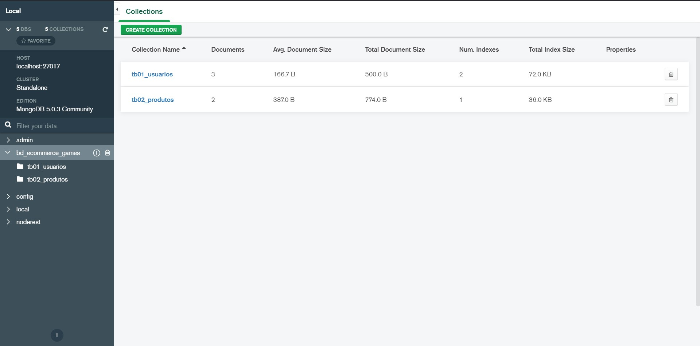

<h1>E-commerceGames-React</h1>
  <h2>Sumário</h2>
    <ul>
      <li><a href="#sobre">Sobre</a></li>
      <li><a href="#tecnologias">Técnologias utilizadas</a></li>
      <li><a href="#requisitos">Pré-requisitos</a></li>
      <li><a href="#instalacao">Rodando a aplicação</a></li>
      <li><a href="#galeria">Galeria Front-End</a></li>
      <li><a href="#galeria2">Galeria Back-End</a></li>
      <li><a href="#nota">Notas</a></li>
    </ul>    
  <h2 id='sobre'>💬 Sobre</h2>
  Este projeto é uma tradução do meu projeto (<a href="https://github.com/RogerSGomes/E-commerceGames">E-commerceGames</a>), feito em PHP, para React. Ele foi criado com o intuito de melhorar meus conhecimentos com esta biblioteca e também para resolver algumas limitações encontradas anteriormente. Como esta é uma tradução, o design e alguns recursos como o cadastro e login de usuários, utilizados no projeto antigo, foram mantidos para que a experiência do usuário (UX) seja a mesma, mesmo com essa mudança de técnologias para produção do produto.
  
  <h2 id='tecnologias'>👨‍💻 Técnologias utilizadas</h2>
  <h3> Front-End </h3>
  <ul>
    <li>Estutura da página: HTML, CSS, JavaScript, React, React-DOM;</li>
    <li>Rotas (com animação ou não): react-router-dom, react-router-hash-link;</li>
    <li>Passagem de parâmetros entre documentos: props (React).</li>
    <li>Consumo de APIs: axios.</li>
    <li>Tratamento de APIs: hooks (React).</li>
  </ul>
  
  <h3> Back-End </h3>
  
  <ul>
    <li>Gerenciamento de pacotes e bibliotecas: Nodejs;</li>
    <li>Construção e acesso ao banco de dados (Troca de informações): MongoDB, mongoose, json e API REST;</li>
    <li>Tratamento e leitura de URL: express, body-parser;</li>
    <li>Atualização do servidor local em tempo-real: nodemon;</li>
    <li>Encriptação de conteúdos importantes: bcrypt;</li>
    <li>Tratamento dinâmico de rotas: fs, path.</li>
  </ul>
  
  <h3> Ferramentas de produção </h3>
  <ul>
    <li>Gerenciamento de API's: Insomnia;</li>
    <li>Editor de texto: VisualStudioCode;</li>
    <li>Banco de dados: MongoDB;</li>
    <li>Comandos do sistema(cmd): PowerShell e cmder.</li>
  </ul>
  
  <h2 id='requisitos'>🧩 Pré-requisitos para rodar a aplicação</h2>
  
Tenha certeza de que seu dispositivo tem o Node.js instalado, senão instale-o no link:

  <ul>
    <a href="https://nodejs.org/en/download/">https://nodejs.org/en/download/</a>
  </ul>
  
O Node.js é um software de código aberto, multiplataforma, baseado no interpretador V8 do Google e que permite a execução de códigos JavaScript fora de um navegador web. Para verificar se ele está instalado, basta executar o seguinte comando no prompt:

  
    node --version
  
  
Juntamente com a instalação do Node.js, seu gerenciador de pacotes (npm) deve ter sido instalado. Para verificar se o npm está presente em seu computador, basta executar o seguinte comando no prompt:

  
    npm --version

  <h2 id='instalacao'>🚀 Rodando a Aplicação</h2>  
  
Para rodar a aplicação basta realizar o download, extrair o arquivo com alguma ferramenta de descompactação de arquivos (recomendado: WinRAR) e acessar a pasta 'www', localizada dentro da pasta raiz do projeto, através de um prompt de comando (recomendado: PowerShell):

    cd -path "c:\..\downloads\E-commerceGames-React-main\www"
  
  
Em seguida, executar o comando:

  
    npm install
  
  
Quando o download finalizar, basta rodar a aplicação com o comando:

    npm start
  
  
Tudo pronto! O projeto já estará rodando na porta 3000 de seu dispositivo, agora é só aproveitar e vizualizar todos os recursos presentes nele.

  <h2 id='galeria'>🖼 Galeria Front-End</h2>
  
Página inicial

  
  
Loja

  
  
  <h2 id='galeria2'>⚙ Galeria Back-End</h2>
  
Requisição de todos os produtos

  
  
Requisição para adicionar um novo produto

  
  
Requisição para cadastro de um usuário

  
  
Requisição para login de um usuário

  
  
Banco de Dados (Mongo DB - Interface)

  
  
  <h2 id='nota'>📃 Notas</h2>
  
Se não for de seu interesse realizar algum download externo, basta esperar até a disponibilização do projeto completo que será feita em uma data posterior.

  
Projeto feito exclusivamente para estudos, ou seja, sem visar nenhuma forma de lucro.

  
Projeto realizado com a ajuda de Robert da Silva Gomes (GitHub: <a href="https://github.com/RobertSGomes/">RobertSGomes</a>).

  
Projeto em desenvolvimento, atualizações serão feitas com o passar do tempo.

  
Front-end e Back-end funcionando separadamente por enquanto.

  
